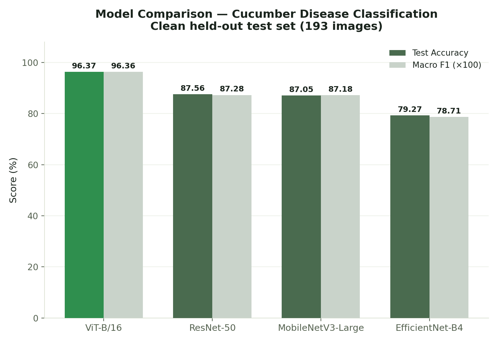
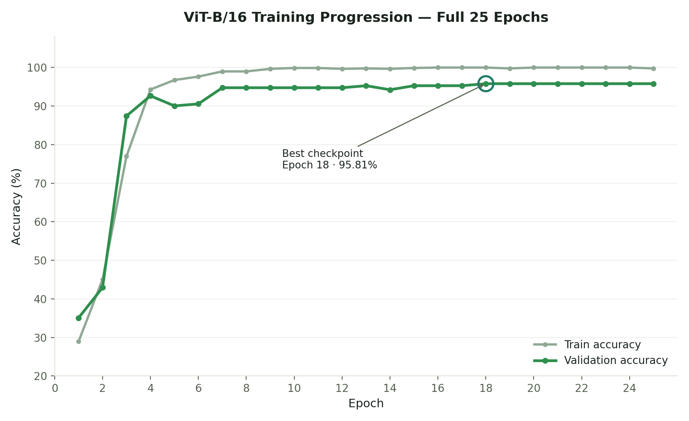
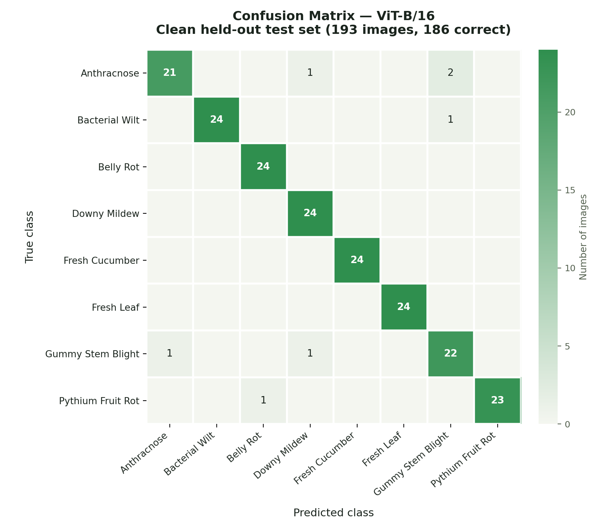

# 🥒 Robust AI-Based Cucumber Disease Detection

A computer vision system for automated cucumber leaf and fruit condition classification using deep learning and image processing.

The project compares multiple CNN and Transformer-based architectures and deploys the selected model through an interactive web application.

---

## 📌 Overview

Early identification of crop diseases can help farmers and agricultural professionals take corrective action before diseases spread significantly.

This project develops an image-based classification pipeline capable of recognizing **8 cucumber leaf/fruit conditions** from images:

1. Anthracnose
2. Bacterial Wilt
3. Belly Rot
4. Downy Mildew
5. Fresh Cucumber
6. Fresh Leaf
7. Gummy Stem Blight
8. Pythium Fruit Rot

Four deep learning architectures were evaluated:

- **ViT-B/16**
- ResNet-50
- MobileNetV3-Large
- EfficientNet-B4

The **ViT-B/16** model was selected as the final classifier because it achieved the highest accuracy on the clean held-out test set.

---

## 🏆 Key Results

### Final Model

| Metric | Result |
|---|---:|
| Model | **ViT-B/16** |
| Classes | **8** |
| Clean test images | **193** |
| Correct predictions | **186 / 193** |
| **Test Accuracy** | **96.37%** |
| **Macro F1-score** | **0.96** |
| Best validation accuracy | **95.81%** |
| Best validation epoch | **18** |

> **96.37% clean held-out test accuracy** is the primary performance result reported by this project.

---

## 📊 Class-wise Performance

| Class | Precision | Recall | F1-score |
|---|---:|---:|---:|
| Anthracnose | 0.95 | 0.88 | 0.91 |
| Bacterial Wilt | 1.00 | 0.96 | 0.98 |
| Belly Rot | 0.96 | 1.00 | 0.98 |
| Downy Mildew | 0.92 | 1.00 | 0.96 |
| Fresh Cucumber | 1.00 | 1.00 | 1.00 |
| Fresh Leaf | 1.00 | 1.00 | 1.00 |
| Gummy Stem Blight | 0.88 | 0.92 | 0.90 |
| Pythium Fruit Rot | 1.00 | 0.96 | 0.98 |

The most challenging class was **Gummy Stem Blight**, followed by **Anthracnose**.

---

## 🔬 Model Comparison

All four primary models were evaluated on the same clean held-out test set.



| Model | Test Accuracy | Macro F1 |
|---|---:|---:|
| 🏆 **ViT-B/16** | **96.37%** | **0.9636** |
| ResNet-50 | 87.56% | 0.8728 |
| MobileNetV3-Large | 87.05% | 0.8718 |
| EfficientNet-B4 | 79.27% | 0.7871 |

### Accuracy advantage of ViT

Compared with the other clean-data models, ViT-B/16 achieved:

- **+8.81 percentage points** over ResNet-50
- **+9.32 percentage points** over MobileNetV3-Large
- **+17.10 percentage points** over EfficientNet-B4

This made ViT-B/16 the preferred model for classification accuracy.

---

## ⚡ Model Efficiency Benchmark

Benchmark performed using:

**NVIDIA GeForce RTX 5050 Laptop GPU**

**CUDA 13.0**

| Model | Parameters | Checkpoint | Latency | Throughput | GPU Memory |
|---|---:|---:|---:|---:|---:|
| **ViT-B/16** | 85.80M | 327.37 MB | 9.63 ms | 103.87 img/s | 367.40 MB |
| ResNet-50 | 23.52M | 90.03 MB | 4.79 ms | 208.91 img/s | 141.77 MB |
| MobileNetV3-Large | 4.21M | 16.25 MB | 5.04 ms | 198.24 img/s | 55.70 MB |
| EfficientNet-B4 | 17.56M | 67.68 MB | 13.29 ms | 75.23 img/s | 115.92 MB |

### Deployment trade-off

ViT-B/16 provides the strongest classification performance but requires substantially more parameters and storage than the lightweight CNN models.

**MobileNetV3-Large** is therefore retained as a potential lightweight deployment alternative when memory, storage, or computational resources are constrained.

---

## 🛡️ Robustness Evaluation

The final ViT-B/16 checkpoint was evaluated under several image perturbations to assess robustness to common image-quality changes.

| Condition | Accuracy |
|---|---:|
| Clean | 95.85% |
| Dark / low brightness | 95.34% |
| Bright / overexposed | 94.82% |
| Gaussian noise | 95.85% |
| JPEG compression | 96.37% |
| Gaussian blur | 91.71% |

The model remained above **94% accuracy** under brightness changes, Gaussian noise, and JPEG compression.

Gaussian blur produced the largest degradation, with accuracy decreasing to **91.71%**.

> Note: The clean score shown in this robustness experiment (95.85%) comes from the robustness evaluation pipeline. The project's official held-out test result is **96.37% (186/193)** from the primary evaluation pipeline.

---

## 🧠 Training

The final ViT-B/16 model was fine-tuned for **25 epochs**.

### Training configuration

- Architecture: **ViT-B/16**
- Input resolution: **224 × 224**
- Optimizer: **AdamW**
- Initial learning rate: **1 × 10⁻⁴**
- Weight decay: **1 × 10⁻⁴**
- Batch size: **32**
- Epochs: **25**
- Freeze backbone initially: **2 epochs**
- Learning-rate scheduling: **Cosine Annealing**
- Loss: **Cross Entropy with label smoothing (0.1)**

### Training progression



Full per-epoch history from `outputs/vit/history.json` (25/25 epochs). Validation accuracy improved rapidly through epoch 7, then plateaued in the 94.7–95.8% range for the remainder of training:

- Epoch 1: **35.08%**
- Epoch 3: **87.43%**
- Epoch 7: **94.76%**
- Epoch 13: **95.29%**
- Epoch 18: **95.81%** ← best checkpoint
- Epoch 25 (final): **95.81%**

The best validation checkpoint occurred at **epoch 18** and was matched (not exceeded) through epoch 25.

Training accuracy approached 100% while validation accuracy stabilized around 95–96%, indicating some degree of overfitting.

The best checkpoint is saved as:

```text
outputs/vit/best.pt
```

---

## 📦 Dataset

The project uses a cucumber disease recognition dataset containing the eight target classes.

The original dataset was audited for duplicate images before creating the clean evaluation split.

### Clean dataset

After duplicate removal:

**1,279 unique images**

were used to create the clean dataset.

Approximate split:

| Split      |    Images |
| ---------- | --------: |
| Training   |       895 |
| Validation |       191 |
| Test       |       193 |
| **Total**  | **1,279** |

The final test set was kept separate from training and validation during the main evaluation.

---

## 🔎 Supplementary 6,400-Image Evaluation

A separate evaluation was also performed using a 6,400-image Hugging Face dataset containing 800 images per class.

### Results

| Split       |     Accuracy |
| ----------- | -----------: |
| Train       |     98.2366% |
| Validation  |     98.5849% |
| Test        |     98.1481% |
| **Overall** | **98.2969%** |

Overall:

**6,291 / 6,400 images correctly classified**

### Important evaluation note

This result is treated as **supplementary rather than an independent benchmark** because the 6,400-image dataset overlaps with the augmented/source data used during project development.

Therefore:

> **98.30% is not used as the project's primary test accuracy.**

The primary reported result remains:

> **96.37% on the clean held-out test set.**

---

## 🌍 External Image Test

The final model was also tested on four manually selected external images.

| Image                        | Expected       | Prediction         | Confidence |
| ----------------------------- | -------------- | ------------------ | ---------: |
| A.jpeg                        | Anthracnose    | **Anthracnose**    |      61.6% |
| BW.jpeg                       | Bacterial Wilt | **Bacterial Wilt** |      45.8% |
| DM.jpeg                       | Downy Mildew   | **Downy Mildew**   |      86.0% |
| Healthy-cucumber-leaf-2.jpeg  | Fresh Leaf     | **Fresh Leaf**     |      92.2% |

All four images were classified correctly.

However, this is only a **qualitative demonstration** because four images are insufficient to establish real-world accuracy.

The model currently predicts one of its eight known classes for every input and does not contain a dedicated **Unknown/OOD class**.

---

## 🔲 Confusion Matrix

The clean held-out test confusion matrix is shown below. Rows represent the true class and columns represent the predicted class.



The majority of errors occur between visually similar disease categories, particularly involving **Anthracnose** and **Gummy Stem Blight**.

---

## 🏗️ System Architecture

```text
                 Input Image
                      │
                      ▼
             Image Preprocessing
                      │
                      ▼
                 ViT-B/16
                      │
                      ▼
              Feature Extraction
                      │
                      ▼
              8-Class Classifier
                      │
                      ▼
        ┌─────────────────────────┐
        │ Disease / Condition     │
        │ + Confidence Scores     │
        └─────────────────────────┘
                      │
                      ▼
             Web Application
```

---

## 🖥️ Application

The project includes an interactive Streamlit application.

The application allows a user to:

1. Upload a cucumber image
2. Preprocess the image
3. Run inference using ViT-B/16
4. Display the predicted condition
5. Display class probabilities/confidence scores

The model is loaded from:

```text
outputs/vit/best.pt
```

---

## 📁 Project Structure

```text
cucumber-disease-detector/
│
├── configs/
│
├── figures/
│   ├── model_comparison.png
│   ├── confusion_matrix.png
│   ├── training_curve.png
│   ├── make_comparison_chart.py
│   ├── make_confusion_matrix.py
│   └── make_training_curve.py
│
├── outputs/
│   └── vit/
│       ├── best.pt
│       ├── history.json
│       ├── test_report.json
│       └── test_6400_report.json
│
├── src/
│   ├── benchmark_models.py
│   ├── check_hf_duplicates.py
│   ├── compare_models.py
│   ├── dataset.py
│   ├── evaluate.py
│   ├── models.py
│   ├── predict.py
│   ├── robustness_test.py
│   ├── split_dataset.py
│   ├── split_dataset_clean.py
│   ├── test_6400.py
│   └── train.py
│
├── app.py
├── README.md
├── requirements.txt
├── .gitignore
└── .gitattributes
```

Large datasets and the Python virtual environment are intentionally excluded from the Git repository.

---

## 🚀 Installation

Clone the repository:

```bash
git clone https://github.com/MayurRD10/cucumber-disease-detector.git
cd cucumber-disease-detector
```

Create a virtual environment:

### Windows

```powershell
python -m venv venv
.\venv\Scripts\Activate.ps1
```

Install dependencies:

```powershell
pip install -r requirements.txt
```

---

## ▶️ Run the Application

Start the Streamlit application:

```powershell
streamlit run app.py
```

The application will provide a local web interface for uploading images and obtaining predictions.

---

## 🔮 Running Inference from the Command Line

For a single image:

```powershell
python src\predict.py `
    --model vit `
    --checkpoint outputs\vit\best.pt `
    --image "path\to\image.jpg"
```

For a folder of images:

```powershell
python src\predict.py `
    --model vit `
    --checkpoint outputs\vit\best.pt `
    --image-dir "path\to\images"
```

---

## 🧪 Evaluation Commands

### Clean test evaluation

```powershell
python src\evaluate.py `
    --model vit `
    --data-dir data_clean `
    --checkpoint outputs\vit\best.pt
```

### Robustness evaluation

```powershell
python src\robustness_test.py `
    --data-dir data_clean `
    --checkpoint outputs\vit\best.pt
```

### Model comparison

```powershell
python src\compare_models.py
```

### Model benchmark

```powershell
python src\benchmark_models.py
```

### Regenerate the report figures

```powershell
python figures\make_comparison_chart.py
python figures\make_confusion_matrix.py
python figures\make_training_curve.py
```

---

## ⚠️ Limitations

Despite strong performance on the clean held-out test set, several limitations remain:

### 1. Limited clean dataset size

The clean dataset contains approximately 1,279 unique images, so larger and more diverse datasets would be useful for stronger generalization.

### 2. Domain shift

Real-world images can differ substantially from training images in:

* Lighting
* Camera quality
* Backgrounds
* Leaf orientation
* Image resolution
* Disease severity
* Plant growth stage

### 3. Unknown inputs

The current classifier has eight known classes and does not explicitly detect unknown or unrelated images.

An unrelated image can therefore still be assigned to one of the eight classes.

### 4. Class confusion

Gummy Stem Blight and Anthracnose were among the most difficult categories in the clean test set.

### 5. Confidence calibration

The displayed probabilities are softmax outputs and should not automatically be interpreted as calibrated probabilities of correctness.

---

## 🔮 Future Improvements

Potential future work includes:

* Expanding the clean dataset with more field images
* Collecting images under different lighting and camera conditions
* Adding an **Unknown/OOD detection** mechanism
* Confidence calibration
* Test-time augmentation
* Model quantization
* ONNX/TensorRT deployment
* Mobile/edge deployment
* Lightweight ViT architectures
* Explainable AI using attention/Grad-CAM-style visualization
* Larger multi-crop disease datasets
* Field-level validation with agricultural experts

---

## 🎯 Project Objective

The overall objective is to develop a robust and deployable computer vision pipeline capable of assisting with automated crop disease recognition.

The project combines:

**Dataset Curation → Image Processing → Data Augmentation → Model Training → Model Comparison → Robustness Testing → Evaluation → Deployment**

The final system demonstrates how modern computer vision models can be evaluated not only for classification accuracy, but also for robustness, computational efficiency, and practical deployment considerations.

---

## 📌 Final Model Selection

**Selected Model: ViT-B/16**

The model was selected because it achieved the highest clean held-out test accuracy among the evaluated architectures:

> **96.37% accuracy | 0.96 macro F1**

While ViT-B/16 has greater computational and storage requirements, its accuracy advantage made it the preferred model for the current prototype.

For resource-constrained deployment, **MobileNetV3-Large** remains a strong lightweight alternative due to its 4.21M parameters and 16.25 MB checkpoint.

---

## 📜 Reproducibility

The repository contains the training, evaluation, prediction, benchmarking, robustness-testing, and dataset-splitting scripts used during development.

The final model checkpoint is managed using **Git LFS** because of its large file size.

---

## 👨‍💻 Project Status

**Status: Prototype / Research Project**

The current system demonstrates successful multi-class cucumber disease recognition and provides a foundation for further field validation and deployment.

---

## ⭐ Results at a Glance

```text
                 CUCUMBER DISEASE DETECTOR

                    ViT-B/16
                       │
                       ▼
              ┌─────────────────┐
              │  8 Classes      │
              │                 │
              │ 96.37% Test     │
              │ Accuracy        │
              │                 │
              │ 0.96 Macro F1   │
              └─────────────────┘

       186 / 193 clean test images correct

        95.34%  Dark images
        94.82%  Bright images
        95.85%  Gaussian noise
        96.37%  JPEG compression
        91.71%  Gaussian blur
```

---

## 📄 License

Add an appropriate license before distributing the project publicly.
